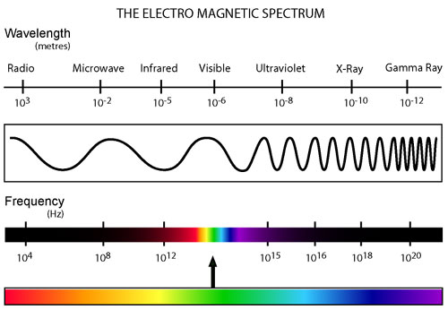

 I decided to post some of my notes online since it was easier to read in the format of a mobile website rather than a pdf file. Now that I'm done with IB, might as well make this public.

<h4>Disclaimer: </h4>

This notes are not meant to replace the notes given by the school. They are simply created by me, for me. They contain things that I think I would forget. I used it as last minute revision while I'm on public transport making my way to school. Do also note that I was learning while creating these notes and there may be some errors which you should be able to spot.

## Topic 1: Measurements
### Definitions

|Term|Definition|
|:---|:---|
|Physical Quantities|Measurable quantities consisting of magnitude and a unit|
|Random Errors|Unpredictable deviations of a measured value from the actual value, with equal chance of falling above or below the actual value|
|Systematic Errors|Errors that occur according to some fixed rules and yield consistent over or under estimation of the true value|

### Base SI Units

|Quantity|Symbol                                                               |
|:---|:---|
|Length|`m` (meter)|
|Time|`s` (second)|
|Mass|`kg` (kilogram)|
|Electric Current|`A` (ampere)|
|Temperature|`K` (Kelvin)|
|Amount of substance|`mol` (mole)|
|Luminous intensity| `cd` (candela)|

## Topic 2: Mechanics
### Definitions

|Term|Definition|
|:---|:---|
|Terminal Velocity|Refers to the constant velocity reached by a falling object when drag force is equal in magnitude to the force that is accelerating the object|
|Drag Force|Retarding force due to air resistance|
|Friction|Force that opposes the relative motion of two surfaces|
|Efficiency|Ratio of useful energy output to total energy output|
|Impulse|Change in momentum caused by a force|
|Elastic Collision|Conserves both momentum and kinetic energy|
|Inelastic collision|Conserves momentum and but not kinetic energy|
|Newton's first law of motion|An object at rest will remain at rest and an object in motion will continue in motion at constant speed in a straight line in the absence of a net force acting on it|
|Netwon's second law of motion|The rate of change of momentum of a body is directly proportional to the netforce acting on it and takes place in the direction of the force|
|Newton's third law of motion|When 2 bodies A and B interact, theforce that A exerts on B is equal and opposite to the force that B exerts on A|
|Principle of conservation of Energy|Energy cannot be created or destroyed but may be converted from one form to another but the total amount of energy in an isolated system remains constant|
|Conservation of Momentum|Total momentum of a closed system is constant provided no external resultant force acts on it|

## Topic 3: Thermal Physics
### Definitions

|Term|Definition|
|:---|:---|
|Boyle's Law|For a gas at a constant temperature the volume and pressure are inversely proportional|
|Charles' Law|If the mass and presure of a gas are constant, the volume is directly proportional to its absolute temperature|
|Avogadro's constant|Number of atoms in 12 grams of carbon-12|
|Internal Energy|Sum of the potential energy and random kinetic energy of all the particles in a substance|
|Properties of an ideal gas|An ideal gas consists of a large number of identical molecules. The volume occupied by the molecules themselves is negligible compared to the volume occupied by the gas. The molecules obey Newton's laws of motion, and they move in random motion|
|Ideal Gas|A gas with no intermolecular force that obeys the ideal gas law, pV = nRT at all temperatures, pressures and volumes|
|Temperature|A measure of the average kinetic energy of the molecules of a substance|
|Kinetic Theory of Gases|The relation of macroscopic behaviour of an ideal gas to the behaviour of its molecules|

Assumptions of kinetic model of an ideal gas
- Gas molecules are constantly moving
- They have negligible volume
- Have negligible intermolecular forces
- Undergo elastic collisions
- Mass of the molecule is negligibly small
- Ideal gas assumes monatomic particles

**Important conceptual shit**
- Ideal gas has no potential energy
- Potential energy is negative. 
- Hence Gas got more internal energy than liquid and solid because they don't have potential energy
- When heating, work is done to overcome the potential energy, thus reducing it to 0

## Topic 4: Waves
### Definitions

|Term|Definition|
|:---|:---|
|Amplitude|Maximum magnitude of displacement from the equilibrium position|
|Simple Harmonic Motion|Oscillatory motion in which acceleration is directly proportional to displacement from point of equilibrium and always directed towards that point|
|Intensity|Rate of energy flow per unit cross-sectional area perpendicular to the direction of wave-propagation|
|Superposition|When two similar waves meet the resultant displacement is the vector sum of individual displacements|
|Modulation|Occurs when the intensitiesof the maxima of the double slit interference pattern is enveloped by the intensity of the single slit interference pattern (basically interference pattern of both single and double slit at the same time)|
|Critical Angle|Angle of incidence in an optically denser medium for which the angle of refraction in the less dense medium is $90^{\circ}$|
|Coherent Sources|Source of waves with constant phase difference and same frequency|
|Standing Wave|Wave formed by the superposition of two waves that are of same type, amplitude, frequency and travelling in opposite directions|

### Electromagnetic Spectrum

{:width="600"}

### Shit I always forget

- Light travels slower in denser medium
- Light bends towards the normal in a denser medium
- Critical angle is largest angle for which refraction can occur

## Topic 5: Electricity and Magnetism
### Definitions

|Term|Definition|
|:---|:---|
|Coulomb's Law|Electrostatic force between 2 point charges is directly proportional to the product of their charges and inversely proportional to the square of the distance between them|
|Electric Field Strength|Force per unit charge acting on a small positive test charge|
|Uniform Electric Field|Elctric field that has a constant magnitude and direction|
|Electrical Potential Difference|Work done per unit charge to move a small positive test charge between 2 points|
|Electronvolt|Work done when a charge is equal to one electron charge is taken across a potential difference of one electric charge|
|Electric Current|Rate of flow of electric charge|
|Drift Velocity|Spped of electrons due to the current|
|Ohm's Law|The current through a conductor is directly proportional to the potential difference across it provided the temperature and other physical conditions remain constant|
|Kirchhoff's First Law|At a junctoin, the algebraic sum of currents is zero|
|Kirchhoff's Second Law|Round any closed loop, the algebraic usm of the emf of cells is equal to the algebraic sum of the potential difference across all individual components|
|Electromotive force|Work done per unit charge in moving a quantity of charge completely around the circuit|
|Motor Effect|Force induced by the magnetic interaction between a current-carrying wire in a magnetic field|

In a system of 2 *spherical* charges,
* Each charge must feel a force of the same size as the force on the other charge
* $F=\frac{kq_1q_2}{r^2}=\frac{q_1q_2}{4\pi\epsilon_0r^2}$
* Notice that the columb constant $k=\frac{1}{4\pi\epsilon_0}$ is basically for spheres

Based on definition for electric field strength, 
* $E=\frac{F}{q_{t}}$ where $q_t$ is the charge experience the force by the field
* $E=\frac{q_f}{4\pi\epsilon_0r^2}$ where $q_f$ is the charge producing the field

Electric potential energy
* Energy = Force*Distance
* $E_p=Fd=\frac{kQq}{r}$
* Electric potential energy is the amount of work done to bring a charge to that point in that field
* Hence releasing a charge from that point in the field would mean the $E_p$ would convert to kinetic energy

## Topic 6: Circular Motion
### Definitions

|Term|Definition|
|:---|:---|
|Newton's Universal Law of Gravitation|The attractive force between two point masses is directly proportional to the product of the masses and inversely proportional to the square oftheir separation|
|Uniform Circular Motion|Motion in a circle of constant radius at constant speed|
|Gravitational Field Strength|Force per unit mass exerted on a test mass placed at that point|

Difference between vertical and horizontal circular motion
* Horizontal motion means centripetal force is constnat
* Vertical circular motion means gravity matters, therefore, centripetal force is changing

## Topic 7: Nuclear Physics
### Definitions

|Term|Definition|
|:---|:---|
|Emission/Absorption Spectra|Set of wavelengths of light emmitted/absorbed by atoms of an element|
|Half-life|Time taken for half the unstable nuclei in a given sample to decay|
|Unified Atomic Mass Unit|Equal to 1/12 the mass of a carbon-12 atom|
|Mass Defect|Difference between total mass of the constituents of a nucleus and the mass of the nucleus|
|Elementary particles|Subatomic particle with no structure|
|Hadrons|Comprise of quarks and include baryons and mesons|
|Leptons|Lighter and more loosely bound particles like electrons|
|Quarks|Heavier, tightly bound particles that make up particles like protons and neutrons|
|Baryons|Comprises of 3 quarks|
|Mesons|Comprises of 1 quark and 1 antiquark|
|Exchange particles|Virtual particles mediating force between interacting particles|
|Antiparticles|Particles with the same mass but different quantum numbers from their corresponding particles|
|Pair Production|Creation of a subatomic particle and its antiparticle from a neutral boson ($W^\pm$, $Z^0$, $\gamma$, $g$)|
|Pair Annihilation|Particle and antiparticle collide and annihilate each other, the total energy of the two particles appearing as electromagnetic radiation ($\gamma$)|

### Conservation laws

#### Shit that are always conserved

* Energy
* Momentum (linear and angular)
* Charge
* Baryon Number
* Lepton Number

#### Shit not always conserved 

* Strangeness (conserved in all electromagnetic and strong interactions but not always in weak interactions)
* Charm (conserved in all electromagnetic and strong interactions but not always in weak interactions)

### Feynman Diagrams

Antiparticles so backwards in time
Normal particles go forward in time

## Topic 8: Energy Production
### Definitions

|Term|Definition|
|:---|:---|
|Primary Source of Energy|Source of energy that has not been transformed or converted before use by the consumers|
|Secondary Source of Energy|Source of energy that results from the transformatoin of a primary source|
|Degradation of Energy|Energy lost/transferred to the surroundings and can no longer be used to do work|
|Enrichment|Increasing the percentage composition of Uranium-235 in fuel rods to make them more fissile|
|Energy Density|Number of joules of energy liberated per unit mass of fuel consumption|
|Critical Mass|Minimum mass needed to sustain a chain fission reaction|
|Enrichment|Refers to increasing the percentage composition of U-235 in fuel rods to make them more fissile|
|Wien's Displacement Law|The black-body radiation curve for different temperatures will peak at different wavelengths that are inversely proportional to the temperature|
|Stefan-Boltzmann Law|Power emmitted by a blackbody is directly proportional to its surface area and absolute temperature raised to the fourth power|
|Solar constant|Amount of solar radiation per unit area, measured on the outer surface of Earth's atmosphere when the earth is at the mean distance away from the sun|

### Parts of a Nuclear Reactor

|Part|Function|
|:---|:---|
|Moderator|Slow down neutrons and allow for further reactions to take place|
|Control Rods|movable rods that readily absorb neutrons. They can be introduced or removed from the reaction chamber in order to control the chain reaction|
|Heat Exchanger|Allows the nuclear reactions to occur in a place that is sealed off from the rest of the environment.|

## Topic 9: Simple Harmonic Motion
### Definitions

|Term|Definition|
|:---|:---|
|Resolution|The minimum distance between distinguishable objects in an image|
|Rayleigh Criterion|2 sources are just resolvable when the first minimum of the diffraction pattern of one of the sourcse falls on the central maximum of the diffraction pattern if the other source|
|Resolvance|Resolvance for a grating is the ratio of the wavelength of light to the smallest difference in wavelength that can be resolved by the grating|
|Doppler Effect|Change in measured frequency due to relative motion of source and observer|

### Phase Difference

Particles moving in the same direction all the time are in phase.
It is possible to vibrate in phase but with difference amplitudes.  
So basically, in a single wave, all nodes in 1 half of a wave are in phase.

### Nodes and Anti-nodes

**Nodes** are points along a medium in a standing wave that appear to be standing still. These points undergo no displacement.  
**Antinodes** are points in the medium that undergo maximum displacement during each vibration cycle.  

### Double Slit interference

$n\lambda=d\sin\theta$
- n is the order
- Central maxima is the 0th order
- $\theta$ is the angle from the center to the m-th order of constructive interference
- $d$ is the slit spacing

### Single slit diffraction

$b\sin\theta=m\lambda$
- Similar equation to the double slit interference ($d\sin\theta=m\lambda$) equation to find maximas, but in single slit it finds the minimas
- $\theta$ is the angle from the center to the minimum, this means that the central maximum width is $2\theta$
- b is the slit width

$\theta = \frac{\lambda}{b}$
- Equation is derived from above, but used only for the central maximum, hence $m=1\ or\  -1$
- The $\sin$ disappears because of the small angle. The sine of a small angle is approximately the angle.
- b is the slit width

### Diffraction Gratings

Nothing much to this, just an application of the above formulas but this time over many slits. 

Visually, using a diffraction grating makes the maxima narrower and more intense because
1. More slits means more light passes through
2. More waves interfere with each other, the intensity is proportional to the square of the amplitude
3. Narrower because of more destructive interference

### Thin-film interference 

Light waves change phase by $\pi$ or $180^{\circ}$ when reflecting off a medium with higher refractive index (E.g. light from air to glass will change phase, but glass to air will not). 

### Resolvance stuff

Circular Aperature: $\theta = 1.22\frac{\lambda}{b}$  
- Theta is the minimum angle that 2 objects can be resolved
- Rayleigh Criterion

### Doppler Effect

For a moving source,
- Speed of sound with respect to observer is unchanged 
- Wavelength changes leading to a change in frequency

For a moving observer,
- Speed of sound with respect to the observer is changed leading to a change in frequency
- Wavelength remains unchanged

## Topic 10: Fields 
### Definitions

|Term|Definition|
|:---|:---|
|Equipotential Surfaces|Regions where the potential is the same|
|Gravitational Potential Energy|Work done by an external force in bringing a small test mass from infinity to that point|
|Gravitational Potential| Work done per unit mass by an external force in bringing a small test mass from infinity to that point|
|Electric Field Strength|Force per unit charge acting on a positive test charge|
|Electric Potential Energy|Work done in moving a small positive test charge from infinity to that point|
|Electric Potential|Work done per unit charge in moving a small positive test charge from infinity to that point|

Gravitational Field Strength or Gravity / Electric Field Strength [Units: $Nkg^{-1}$ or $NC^{-1}$]
- $g =\frac{F}{m} =\frac{GM}{r^2}=-\frac{\Delta V_g}{\Delta r}$
- $E=\frac{F}{q} = \frac{KQ}{r^2} = \frac{\Delta V_e}{\Delta r}$

Force or Gravitational Force / Electric Force [Units: $N$]
- weight = mass*gravity
- $F=mg=\frac{GMm}{r^2}$ / $F=Eq=\frac{kQq}{r^2}$

Gravitational Potential Energy / Electric Potential Energy [Units: $J$] 
- Energy = Work done = Force*Distance
- $E_p=Fd=-\frac{GMm}{r}$ / $E_p=Fd=-\frac{kQq}{r}$

Gravitational Potential / Electric Potential or Voltage (Potential difference) [Units: $Jkg^{-1}$ or $JC^{-1} / V$]
- Potential (Energy per unit mass/charge) vs Potential Energy
- Alternatively, $V = \frac{W}{m}\ or\ \frac{W}{q} = \frac{Fd}{m} = \frac{Fd}{q}$
- Hence $V_g=\frac{E_p}{m} = \frac{Fd}{m} =-\frac{GM}{r}$ / $V_e=\frac{E_p}{q}=\frac{Fd}{q}=\frac{kQ}{r}$

### Difference between gravitational and electrical fields

- Gavitational Fields are only attractive whereas Electric fields are attractive/repulsive

### Important conceptual shit

- Potential is a scalar quantity. When there is more than 1 mass or charge, potential at a point is the sum of individual potentials
- Inside a charged sphere, potential is the same everywhere. Hence potential gradient is 0, which means field strength is 0.
- Columnb constant is for spherical charges. For charged parallel plates, use $\frac{\Delta V}{\Delta d}=\frac{V}{d}$ instead of $\frac{kQq}{r}$

## Topic 11: Electromagnetic induction

### Definitions

|Term|Definition|
|:---|:---|
|Magnetic Flux (Linkage)|Measure of the component of the magnetic field passing though the surface and is proportional to the number of magnetic field lines which intersect the surface (through a coil)|
|Faraday's Law of Induction|Magnitude of the induced emf is proportional to the rate of change of the flux linkage|
|Lenz's Law|Induced EMF acts in the direction such that the current induced opposes the change which caused it|
|Rectification|Conversion of alternating current to direct current using diodes|
|Capacitance|Charge stored by a device for a potential difference of 1 volt across the device|
|Time Constant|Time required to charge a capcitor, through a resister, from an initial charge voltage of 0 to approximately 63.2%|

### Rules

* Fleming's left-hand rule
	- Use to find direction of Force/Current/Field 
* Fleming's right-hand rule
	- Use for generators
* Maxwell's right-hand grip rule
	- To tell the poles induced by solenoid or Clockwise/Anticlockwise field
* Lenz's law
	- Tells us the direction of the force
* Faraday's law
	- Look at definition

### Wires and induction stuff

- Questions always like to test combination of the 2 formulas: 
	- $\Phi = BA\cos\theta$
	- $\epsilon = -N\frac{\Delta\Phi}{\Delta t}$
- Also remember the existence of the formulas in topic 5
	- $F=qvb\sin\theta$
	- $F=BIL\sin\theta$
	- Used to find force on moving wire or charge in a magnetic field

## Topic 12: Quantum Physics
### Definitions

|Term|Definition|
|:---|:---|
|Photoelectric Effect|Emission of electrons from a metal's surface when electromagnetic radiation of sufficiently high frequency is shone on it|
|Work Function|Minimum amount of energy required for an electron to escape from the surface of a metal|
|DeBroglie Hypothesis|There is a wavelength manifested in all the objects given by the equation $\lambda=\frac{h}{p}$ where $h$ is Plank's Constant and $p$ is momentum|
|Pair production|When a high energy photon collides with a nucleus, it makes a pair of electron and positron|
|Pair annihilation|Matter collides with its corresponding antimatter, they annihiliate one another with the conservation of energy, momentum, and charge|
|Heisenberg Uncertainty Principle|Position and momentum cannot be simultaneously measured with precision|
|Decay Constant|Probability of dcay of a single nucleus per unit time|
|Wave function|The square of the amplitude of the wave function represents the probability of finding the particle at that position at that time.|

### Newtonian vs Relativistic behaviours

Some kinematics equations can't be used when dealing with small little shits. 
At low velocities, relativistic momentum is equivalent to classical momentum. 
The same is not true at high velocities (close to speed of light). This shit probably don't need to worry too much.

Also here are some equations not in the formula booklet

$\lambda = \frac{h}{p} = \frac{h}{\sqrt{2mE}) = \frac{hc}{E}$

$E^2=(mc^2)^2 + (pc)^2$

### Photoelectric effect and stopping potential experiment

Things to note:
- Work function is the minimum energy required to remove an electron from a solid 
- **Maximum** kinetic energy $E=hf-\phi$ is dependent on frequency of light
- Not all electrons have the same kinetic energy as the bond energy may be different. Workfunction is the minimum and a constant for all electrons.
- Number of electrons is proportional to intensity of the light.
- Intensity does not affect kinetic energy. This supports the explanation that light behaves as particles since the energy of a single particle is transferred to the electron. 

Predictions of classical model that do not hold:
- Light as a electromagnetic wave interacts with the electron by exerting a force. Therefore, a threshold intensity is required to free an electron. However, evidence shows a threshold frequency instead.
- If light behaves as a wave, resonance might help free the electron (light at the natural frequency of the electron would be more significant). However, evidence shows light of any frequency above the threshold frequency would free an electron.
 
### Uncertainty Bullshit

Position and Momentum cannot be measured precisely at the same time.  
Uncertainty in position is in metres since momentum is also 1-dimensional.    
For most questions, 
- Size of whatever the thing is discussing is most likely the uncertainty in position.
- In momentum, mass is most likely known, so velocity is the one that is uncertain

If uncertainty in position exceeds the space in which the particle is confined to, the transmission of the particle through the energy barrier is known as quantum tunneling

## Option C: Light
### Lenses and Mirrors

|Term|Definition|
|:---|:---|
|Spherical Aberration|Light rays focus at different points after passing through a spherical surface|
|Chromatic Aberration|Refractive index depends on wavelength of light. Light of different wavelengths refract at different angles and converge at different focal lengths.|

|Object Location|Image Location|Image Properties (Converging - Convex Lens/Concave Mirror) | Image Properties (Diverging - Concave Lens/Convex Mirror)
|:---:|:---:|:---:|:---:|
|Infinity|F| Real, Inverted, Diminished|Virtual, Upright, Diminished|
|Greater than 2F|Between F and 2F| Real, Inverted, Diminished|Virtual, Upright, Diminished|
|At 2F|At 2F| Real, Inverted, Same Size|Virtual, Upright, Diminished|
|Between F and 2F|Greater than 2F| Real, Inverted, Magnified|Virtual, Upright, Diminished|
|At F|Infinity|-|Virtual, Upright, Diminished|
|Lesser than F|Same side as Object|Virtual, Upright, Magnified|Virtual, Upright, Diminished|

Power of lens: $\frac{1}{f}$

Points to note:
- Image is virtual when v is negative
- Focal length of diverging (concave) lens is negative
- Focal length of diverging (convex) mirror is negative

### Compound Microscopes

- Objective lens forms real magnified image
- Eyepiece forms virutal magnified image
- Normal adjustment means final image is form at the near point so that maximum angular magnification is obtained
- Magnification in normal adjustment: $\frac{h_i}{h_0}$

### Telescopes

#### Astronomical Refracting Telescope

Image is coming from infinity, hence
- Objective forms a real diminished image
- Eyepiece forms a virtual magnified image

#### Astronomical Reflecting Telescope

**Newtonian Mounting** 
- Uses 1 concave and 1 small flat mirror
- Eyepiece lens on the side of the telescope

**Cassegrain Mounting**
- Uses 1 concave and 1 small convex mirror
- Eyepiece lens behind the concave mirror

### Fibre Optics

|Term|Definition|
|:---|:---|
|Chromatic/Material Dispersion|As light travels along an optical fibre, different frequencies will travel at slightly different speeds. This means that if the source of light involves a range of frequencies, then a pulse that starts out as a square wave will tend to spread out as it travels along the fibre.|
|Modal Dispersion/Waveguide Dispersion| The path length along the centre of a bre is shorter than a path that involves multiple reections. This means that rays from a particular pulse will not all arrive at the same time because of the different distances they have travelled|
|Attentuation|Reduction of the intensity or signal strength.|

Graded Index Fibre
- Refractive index near the edge of the core is less than at the centre
- Speed of rays which are reflected from the cladding are greater than the speed of rays which travel along the centre of the core
- Dispersion is lower

Benefits:
- Greater security
- High bandwidth
- Low distortion/Low Noise
- Low attentuation require less energy
- Not affected by electromagnetic interference

Fiber optic transmission wavelengths are determined by two factors: longer wavelengths in the infrared for lower loss in the glass fiber and at wavelengths which are between the absorption bands. Thus the normal wavelengths are 850, 1300 and 1550 nm. Fortunately, we are also able to make transmitters (lasers or LEDs) and receivers (photodetectors) at these particular wavelengths.

If the attenuation of the fiber is less at longer wavelengths, why don't we use even longer wavelengths? The infrared wavelengths transition between light and heat, like you can see the dull red glow of an electric heating element and feel the heat. At longer wavelengths, ambient temperature becomes background noise, disturbing signals. And there are significant water bands in the infrared.

### Parts of an X-ray

|Part|Purpose|
|:---|:---|
|Aluminium Filter|The aluminium filter will remove lower energy photons from the X-ray beam. Whilst this will reduce the radiation dose to the patient, it will also cause a reduction in image contrast.|
|Collimator|Narrows the x-ray beams such that the emerging beam is parallel to each other. Prevents unnecessary exposure of anatomy outside the area of interest and reduces scatter radiation from these areas.Modal dispersion is a distortion mechanism occurring in multimode fibers and other waveguides, in which the signal is spread in time because the propagation velocity of the optical signal is not the same for all modes.|
|Lead Grid|Absorb scatter radiation emitted by body tissues before reaching the film/IP plate in order to increase image contrast and detail.|
|Air Gap|Literally an air gap between film and patient. Improves image contrast resolution through reducing the amount of scattered radiation that reaches the image detector. Only relatively parallel beams reach the film.|

2 types of scattering: Simple scattering and Photoelectric effect

Linear Attentuation coefficient: Probability of a single electron being absorbed in 1m of material  
Mass Attentuation coefficient: ^ that but instead of per unit length it's per unit mass so you divide by density. So you have $I=I_0 e^{-(\frac{\mu}{\rho})\rho x}$

### Ultrasound Process

|Term|Definition|
|:---|:---|
|Acoustic Impedeance|The acoustic impedance of a substance is the product of the density, ρ, and the speed of sound, c|
|Resolution|Size of smallest object that can be imaged|

- Alternating current is applied to a piezoelectric cystal
- Piezoelectric crystal vibrates producing ultrasound waves (Ultrasound transducer emits waves)
- Alternating current is turned off
- Ultrasound waves are reflected at the boundaries between fluid and soft tissue or tissue and bone
- The ultrasound waves vibrate the piezoelectric crystal producing a alternating current
- The time taken for these reflections can be used to calculate where the boundaries are located
- Information is presented in either an A-scan (amplitude-modulated scan) or B-scan (brightness-modulated scan)
- A-scan is useful to find out where the internal organs are and take a precise measurement of distance
- B-scan can be used to form a 2D image by taking several B-scans at a time

### NMR Process

- When molecules are placed in a strong magnetic field, the spins of the nuclei are aligned to the field
- A gradient field is applied which aligns the spin of the nuclei in a particular precession (this allows us to determine the postition where the radiation is emitted)
- A pulse of radio waves at the larmor frequency is applied which causes the nuclei to undergo a spin transition
- After the pulse, the nucei return to their lower energy state by emitting radio waves
- The time over which radio waves are emitted is called the relaxation time
- The radio waves emitted are received by the RF receiver and is used to produce image scan
- The relaxation times depend on the type of tissue where radiation is emitted

##### Gradient field wizardry (need check)

Frequency of EM (radio) waves emitted depends on the magnetic field strength B. With a gradient field, B varies at different points so the gradient field allows the determination of the (exact) point from which the photons are emitted (every part of the body has a different magnetic field strength & a different frequency of precession/Larmor frequency).
